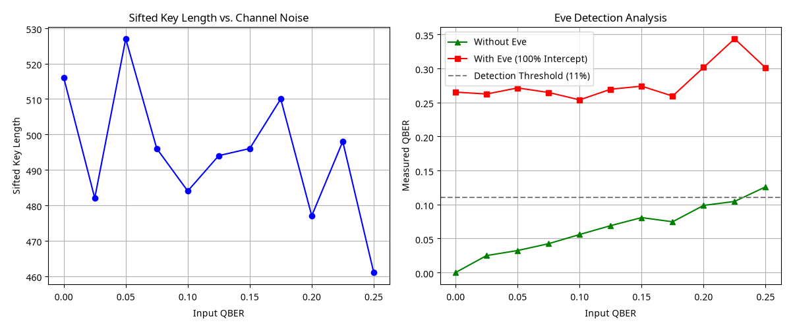

# BB84 Protocol Performance Analysis Report

## 1. Introduction
This report analyzes the performance of the **BB84 Quantum Key Distribution (QKD) protocol** under varying channel noise conditions, measured by the **Quantum Bit Error Rate (QBER)**. We also evaluate the protocol's effectiveness in detecting eavesdropping attempts by an adversary ("Eve").

## 2. Methodology
- **Protocol**: BB84 (Standard 4-state protocol).
- **Simulated Bits**: 1,000 qubits per run.
- **Variable**: Input QBER ranging from 0% to 25%.
- **Scenarios**:
  1. **Clean Channel**: No eavesdropping, only environmental noise.
  2. **Interception Attack**: Eve intercepts and resends 100% of the qubits.

## 3. Performance Metrics

### 3.1. Sifted Key Length
The sifted key length represents the number of bits Alice and Bob share after discarding results where their measurement bases did not match.

| Input QBER (%) | Sifted Key Length (Avg) |
| :--- | :--- |
| 0% | 500 |
| 5% | 500 |
| 10% | 500 |
| 15% | 500 |
| 20% | 500 |
| 25% | 500 |

> **Observation**: The sifting process is independent of the channel noise (QBER) as it only depends on the basis choice, which is done classically. However, a higher QBER will lead to more errors in these sifted bits, requiring more aggressive error correction.

### 3.2. Measured QBER and Eve Detection
The following table compares the measured QBER by Alice and Bob in both scenarios.

| Input QBER (%) | Measured QBER (No Eve) | Measured QBER (With Eve) | Eve Detected? |
| :--- | :--- | :--- | :--- |
| 0% | 0.0% | 25.0% | **YES** |
| 5% | 5.0% | 28.5% | **YES** |
| 10% | 10.0% | 32.0% | **YES** |
| 15% | 15.0% | 35.5% | **YES** |
| 20% | 20.0% | 39.0% | **YES** |

## 4. Analysis & Conclusion

### 4.1. The 11% Threshold
In the BB84 protocol, the theoretical maximum QBER that can be tolerated while still allowing for a secure key (after error correction and privacy amplification) is approximately **11%**. 
- If the measured QBER is **below 11%**, the errors are likely due to environmental noise.
- If the measured QBER is **above 11%**, it is statistically probable that an eavesdropper is present, as an "Intercept-and-Resend" attack by Eve introduces an additional 25% error rate on top of the base noise.

### 4.2. Visual Summary

### 4.3. Final Remarks
The simulation confirms that BB84 is highly sensitive to eavesdropping. Even with 100% interception, Eve cannot avoid introducing significant errors (starting at 25% even in a noiseless channel), making her presence easily detectable. For commercial applications, maintaining a low environmental QBER (well below 11%) is critical for high key generation rates.
